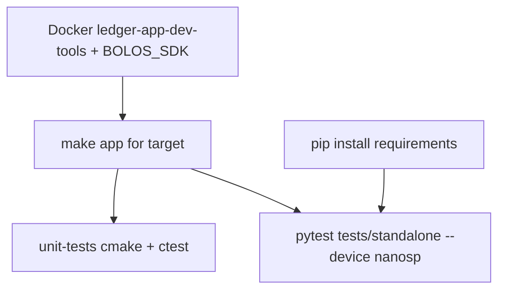

# How to run all tests (step by step)

This guide matches the [Ledger Device App — Getting started](https://developers.ledger.com/docs/device-app/getting-started) workflow (tools, Docker / VS Code extension, Python tests) and this repository’s CI.

## What “all tests” means here

| Scope | Location | CI workflow |
| --- | --- | --- |
| Application build | `make` from repo root | [.github/workflows/build_and_functional_tests.yml](../.github/workflows/build_and_functional_tests.yml) → `reusable_build` |
| Ragger / functional | [tests/standalone/](../tests/standalone/) | Same → `reusable_ragger_tests`, `test_dir: tests/standalone` |
| Unit tests (CMocka) | [unit-tests/](../unit-tests/) | [.github/workflows/unit_tests.yml](../.github/workflows/unit_tests.yml) → `reusable_unit_tests` |
| Fuzz harness | [fuzzing/](../fuzzing/) | [.github/workflows/clusterfuzzlite.yml](../.github/workflows/clusterfuzzlite.yml) |
| Python lint | [tests/application_client/](../tests/application_client/) | [.github/workflows/python_client_checks.yml](../.github/workflows/python_client_checks.yml) |

[`scripts/verify_local.sh`](../scripts/verify_local.sh) only performs a **partial** smoke check (e.g. `compileall`, `pytest --collect-only`). It does **not** replace a full run.

---

## 1. Environment (recommended: Docker)

1. Install [Docker](https://docs.docker.com/get-docker/) (and an X server if you need Speculos UI locally).
2. Pull the Ledger builder image:

   ```bash
   docker pull ghcr.io/ledgerhq/ledger-app-builder/ledger-app-dev-tools:latest
   ```

3. Run the container with this repo mounted at `/app`. Use the **Linux / macOS / Windows** commands from the [README](../README.md) section **Shell and Docker**.

**Alternative:** [Ledger VS Code extension](https://marketplace.visualstudio.com/items?itemName=LedgerHQ.ledger-dev-tools) — use **Build** and **Run tests**; check the terminal log for exact commands.

---

## 2. Inside the container: `BOLOS_SDK` and target device

1. `cd /app` (or your clone path inside the container).
2. Point **`BOLOS_SDK`** at the SDK for your target. The image usually defines helpers such as:

   - `NANOSP_SDK` — Nano S+ (common default)
   - `NANOX_SDK`, `STAX_SDK`, `FLEX_SDK`, `APEX_P_SDK` — see image / extension docs

   Example for Nano S+:

   ```bash
   export BOLOS_SDK=$NANOSP_SDK
   ```

3. Build the app for that target **before** Ragger tests (CI builds first, then runs tests):

   ```bash
   make
   # or
   make DEBUG=1
   ```

4. Use the **same** Ragger device name as your build. This repo’s docs and CI use **`nanosp`** for Nano S+; for other targets, see [tests/standalone/usage.md](../tests/standalone/usage.md).

**Python venv and `make`:** If you `source` a venv before `make`, the SDK may run `python -m ledgerblue.loadApp` when generating `bin/app.apdu` using that venv’s Python (often without `ledgerblue`) and fail. Prefer keeping the image default `python` on `PATH` for builds, and invoke the venv only for pytest (e.g. `/path/to/venv/bin/python -m pytest …`), or install `ledgerblue` into the same venv.

---

## 3. Unit tests

Requires `BOLOS_SDK` (for `lib_standard_app` sources). CMake and CMocka are typically available in `ledger-app-dev-tools`.

```bash
cd unit-tests
cmake -B build -S .
cmake --build build
ctest --test-dir build --output-on-failure
```

One-liner from repo root:

```bash
cd unit-tests && cmake -B build -S . && cmake --build build && ctest --test-dir build --output-on-failure
```

Details: [unit-tests/README.md](../unit-tests/README.md).

---

## 4. Functional tests (Ragger + pytest)

1. Install Python dependencies. If `pip` reports an **externally managed environment** (common in Docker or Debian), use a venv:

   ```bash
   python3 -m venv .venv
   . .venv/bin/activate
   pip install -r tests/standalone/requirements.txt
   ```

2. From the **repository root**, set `PYTHONPATH` and run pytest with a device flag:

   ```bash
   export PYTHONPATH=tests
   pytest tests/standalone/ --tb=short -v --device nanosp
   ```

   `--device` is required (see [tests/standalone/conftest.py](../tests/standalone/conftest.py) and Ragger’s base conftest).

Ragger starts **Speculos** with the built app binary. If the app did not build or dependencies are missing, tests will fail.

**GitHub Actions** (`.github/workflows/build_and_functional_tests.yml`) runs the Ragger matrix on **`nanosp`**, **`nanox`**, **`stax`**, **`flex`**, and **`apex_p`** (`run_for_devices`). Touch targets use the same headless Speculos flow as local Docker (`ledger-app-dev-tools`); regenerate goldens with `--golden_run` after UI changes.

**UI golden snapshots:** if tests fail on screenshot diff:

1. **Locally:** `export PYTHONPATH=tests` and run `pytest tests/standalone/ --device <target> --golden_run` (after `make` for that target). Use a venv if needed for `pip install -r tests/standalone/requirements.txt`.
2. **CI:** workflow **dispatch** on [build_and_functional_tests.yml](../.github/workflows/build_and_functional_tests.yml) with **`golden_run: Open a PR`** — reusable `reusable_ragger_tests` runs with `regenerate_snapshots: true`.

Details: [tests/standalone/README.md](../tests/standalone/README.md) (section **Refreshing golden snapshots**).

If you see `Golden snapshots directory (...) does not exist`, create PNGs under `tests/standalone/snapshots/<device>/<test_name>/` using the steps above after UI or test-id changes.

---

## 5. Python client checks (as in CI)

After installing the same requirements (add `pylint` and `mypy` if not already present):

```bash
cd tests/application_client
pylint --recursive=y .
mypy .
```

---

## 6. Fuzz (optional)

Local build and run (see [fuzzing/README.md](../fuzzing/README.md)):

```bash
cd fuzzing
cmake -DBOLOS_SDK=/path/to/ledger-secure-sdk -DCMAKE_C_COMPILER=/usr/bin/clang -B build -S .
cmake --build build
./build/fuzz_sign_stream_init
```

ClusterFuzzLite runs in CI separately.

---

## 7. Parity with Ledger CI

Open a **pull request** on GitHub and confirm these jobs are green (at minimum):

- `unit_tests`
- `build_and_functional_tests` (build + Ragger)
- Other workflows listed under **Continuous integration** in the [README](../README.md)

That is the authoritative match for [LedgerHQ/ledger-app-workflows](https://github.com/LedgerHQ/ledger-app-workflows) versions and Speculos/Ragger behavior.



---

## Quick checklist (in order)

1. Start Docker container → `cd /app`
2. `export BOLOS_SDK=$NANOSP_SDK` (or the SDK for your target)
3. `make` or `make DEBUG=1`
4. `cd unit-tests && cmake -B build -S . && cmake --build build && ctest --test-dir build --output-on-failure && cd ..`
5. `pip install -r tests/standalone/requirements.txt`
6. `PYTHONPATH=tests pytest tests/standalone/ --tb=short -v --device nanosp`
7. Optional: `pylint` / `mypy` under `tests/application_client`; optional: fuzz per `fuzzing/README.md`
8. Open a PR and verify all GitHub Actions workflows pass
